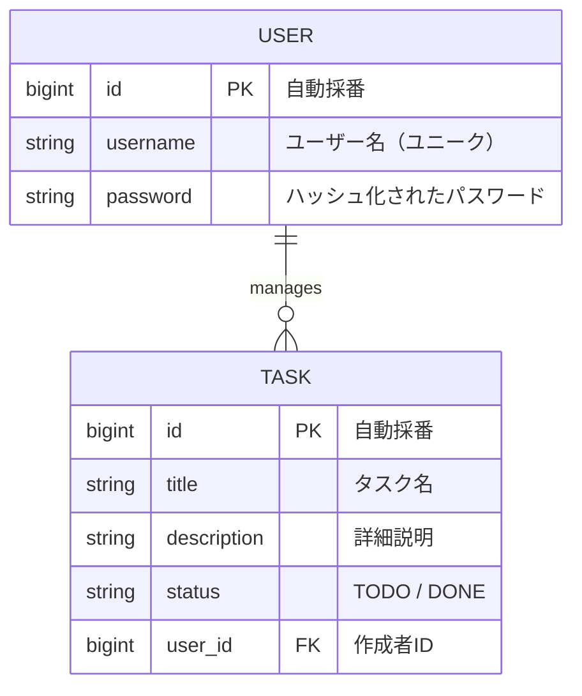

# Task & Knowledge Management App

Spring Boot 4 のタスク管理およびナレッジ共有プラットフォームです。
現在は **Sprint 4 (ユーザー認証機能の実装)** ステップです。

## 🛠 利用技術
### Backend
- **Java 25** 
- **Spring Boot 4.0.0** (Spring Framework 7 ベース)
- **Gradle 8.x**
- **Spring Data JPA**
- **MySQL Driver**

### Frontend
- **React 18+**
- **Vite**
- **TypeScript**
- **Axios** (API通信)

### Infrastructure
- **Docker / Docker Compose**
- **MySQL 8.0**

## 🔐 セキュリティと環境設定
本プロジェクトでは、DBのユーザー名やパスワードなどの機密情報を保護するため、**環境変数 (.env)** を利用しています。

- `.env` ファイルは Git 管理から除外（`.gitignore`）されています。
  - DB_PASSWORD=パスワード となる`.env` ファイルをプロジェクト直下に作成してください。
- 各コンテナの設定は `docker-compose.yml` を通じて `.env` から注入されます。

## 📊 設計図 (Sprint 3 時点)

### ER図


### シーケンス図
```mermaid
sequenceDiagram
    participant User as ユーザー
    participant React as React Frontend
    participant API as Spring Boot API
    participant DB as MySQL

    Note over User, DB: 【Sprint 1: 参照】
    React->>API: GET /api/tasks
    API->>DB: SELECT * FROM tasks
    DB-->>API: Task List
    API-->>React: 200 OK (JSON)

    Note over User, DB: 【Sprint 2: 登録 (Java 25 Record活用)】
    User->>React: タスク入力・保存ボタン
    React->>API: POST /api/tasks (TaskRequest Record)
    API->>DB: INSERT INTO tasks
    DB-->>API: Saved Task
    API-->>React: 201 Created

    Note over User, DB: 【Sprint 3: 更新(Toggle) & 削除 & 例外処理】
    rect rgb(240, 248, 255)
    User->>React: 「完了」ボタンクリック
    React->>API: PATCH /api/tasks/{id}/toggle
    API->>DB: SELECT & UPDATE status
    API-->>React: 200 OK (Updated Task)
    end

    rect rgb(255, 240, 240)
    User->>React: 「削除」ボタンクリック
    React->>React: confirm("本当に削除しますか？")
    React->>API: DELETE /api/tasks/{id}
    API->>DB: DELETE FROM tasks
    API-->>React: 200 OK
    end

    Note over User, DB: 【Sprint 4: 認証基盤】
    User->>FE: サインアップ/ログイン
    FE->>BE: APIリクエスト (POST /api/auth/signup)
    BE->>DB: ユーザー情報を保存
    DB-->>BE: 成功
    BE-->>FE: 201 Created
    end

    Note right of API: ID不在時は ResourceNotFoundException (404) を返却
```

## 各サービスへのアクセス
- Frontend (React): http://localhost:5173
- Backend API: http://localhost:8080/api/tasks
- phpMyAdmin (DB管理): http://localhost:8081

## 🚀 プロジェクトの現状: Sprint 4 完了　ユーザー認証機能の実装
### Sprint 1
- **インフラ:** Docker Compose による全環境（DB/Backend/Frontend）のコンテナ化
- **DB:** MySQL 8.0 の構築と初期データの疎通
- **Backend:** Spring Boot 4 (Java 25) による REST API の実装（一覧取得機能）
- **Frontend:** React (Vite + TypeScript) による API 連携とデータ表示

### Sprint 2
- **Backend:** 登録機能の実装とserviceレイヤーでのトランザクション機構実装
- **Frontend:** 登録機能の実装。デザイン性の向上
- **Backend/Frontend:** Unitテストの実装

### Sprint 3
- **Backend:** 編集・削除機能の実装
- **Frontend:** 編集・削除機能の実装

### Sprint 4
- **Backend:** Spring Securityによる認証機能実装(簡易的にBasic認証)
- **Frontend:** ユーザー登録、ログイン機能実装　※まだタスクとの関連付けは未実装
