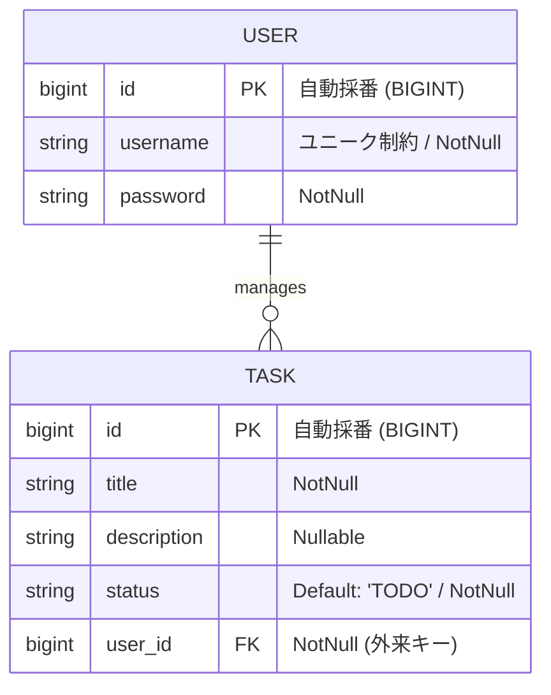
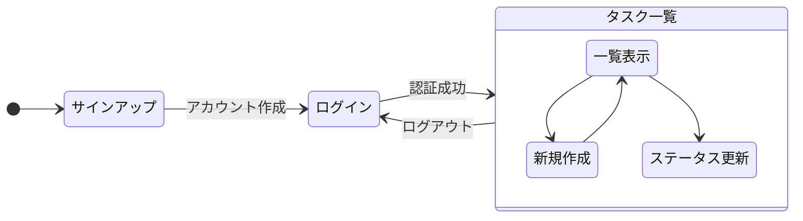

# Task & Knowledge Management App

Spring Boot 4 のタスク管理およびナレッジ共有プラットフォームです。
現在は **Sprint 5 (ユーザーに応じたタスクの表示)** ステップです。

## 🛠 利用技術
### Backend
- **Java 25** 
- **Spring Boot 4.0.0** (Spring Framework 7 ベース)
- **Gradle 8.x**
- **Spring Data JPA**
- **MySQL Driver**

### Frontend
- **React 18+**
- **Vite**
- **TypeScript**
- **Axios** (API通信)

### Infrastructure
- **Docker / Docker Compose**
- **MySQL 8.0**

## 🔐 セキュリティと環境設定
本プロジェクトでは、DBのユーザー名やパスワードなどの機密情報を保護するため、**環境変数 (.env)** を利用しています。

- `.env` ファイルは Git 管理から除外（`.gitignore`）されています。
  - DB_PASSWORD=パスワード となる`.env` ファイルをプロジェクト直下に作成してください。
- 各コンテナの設定は `docker-compose.yml` を通じて `.env` から注入されます。

## 📊 設計図 (Sprint 5 時点)

### ER図

### 画面遷移図

## 各サービスへのアクセス
- Frontend (React): http://localhost:5173
- Backend API: http://localhost:8080/api/tasks
- phpMyAdmin (DB管理): http://localhost:8081

## 🚀 プロジェクトの現状: Sprint 4 完了　ユーザー認証機能の実装
### Sprint 1
- **インフラ:** Docker Compose による全環境（DB/Backend/Frontend）のコンテナ化
- **DB:** MySQL 8.0 の構築と初期データの疎通
- **Backend:** Spring Boot 4 (Java 25) による REST API の実装（一覧取得機能）
- **Frontend:** React (Vite + TypeScript) による API 連携とデータ表示

### Sprint 2
- **Backend:** 登録機能の実装とserviceレイヤーでのトランザクション機構実装
- **Frontend:** 登録機能の実装。デザイン性の向上
- **Backend/Frontend:** Unitテストの実装

### Sprint 3
- **Backend:** 編集・削除機能の実装
- **Frontend:** 編集・削除機能の実装

### Sprint 4
- **Backend:** Spring Securityによる認証機能実装(簡易的にBasic認証)
- **Frontend:** ユーザー登録、ログイン機能実装　※まだタスクとの関連付けは未実装

### Sprint 5(予定)　ユーザーに応じたタスクの表示
- **Backend:** ユーザー別にタスクのCRUDを行うように実装

### Sprint 6(予定)　他ユーザーへのタスクのアサイン
### Sprint 7(予定)　タスク期限日の設定
